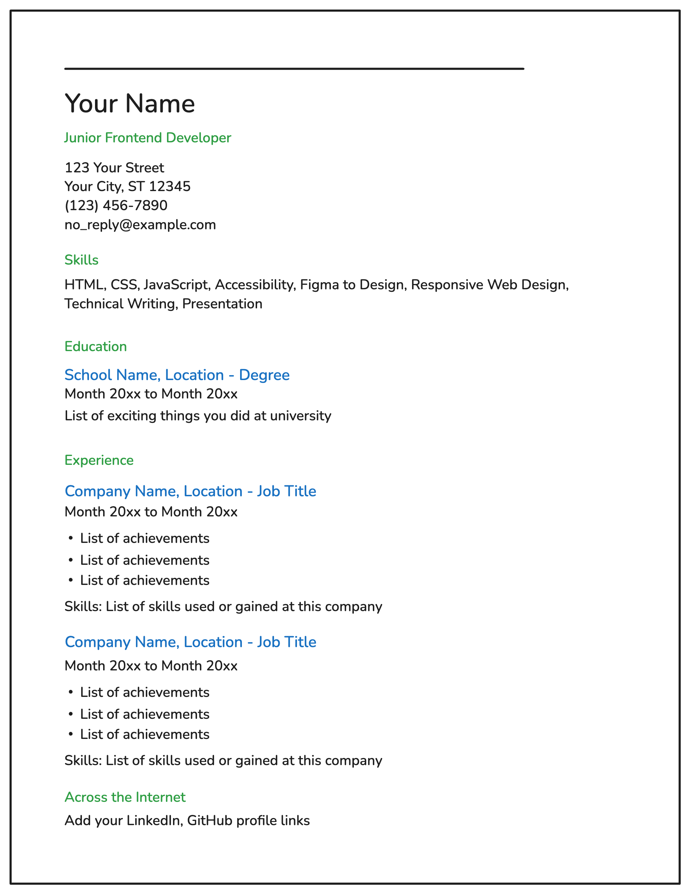

# Single-Page CV
In this project I create a single-page CV (Curriculum Vitae) using only HTML.

## Visual Wireframe:

Key requirements for this project:

- Semantic HTML: Use appropriate HTML tags to structure your CV.

- SEO Meta Tags: Include essential meta tags for SEO.

- Open Graph (OG) Tags: Add OG tags for better social media sharing.

- Favicon: Add a favicon for your CV page.

## Submission Checklist:

- [x] Semantically correct HTML structure.

- [x] Single-page layout with sections for education, skills, and career history.

- [x] SEO meta tags in the head section.

- [x] OG tags for better social media sharing.

- [x] A favicon linked in the head section.

